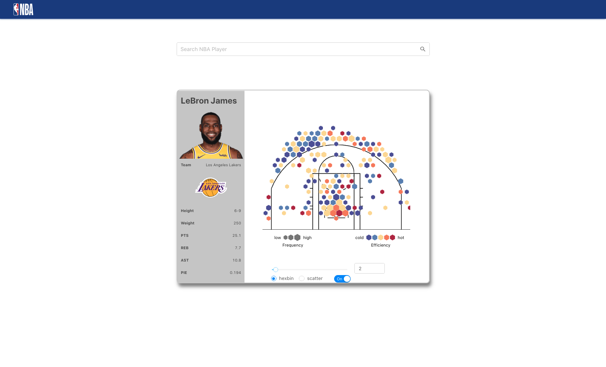

## NBA-Visual: React JS based NBA Player Strength Visualization

- Implemented a dashboard using React, D3 and Ant Design to visualize individual player’s shot data, including a shot chart and user profile view
- Fetched player data from an API provided by stats.nba.com
- Created filters and themes( hexbin and scatter) to provide more customized visualization on the shot chart
- Optimized UI by adding a autocomplete player search bar providing a list of players in the suggestion list

### APP

